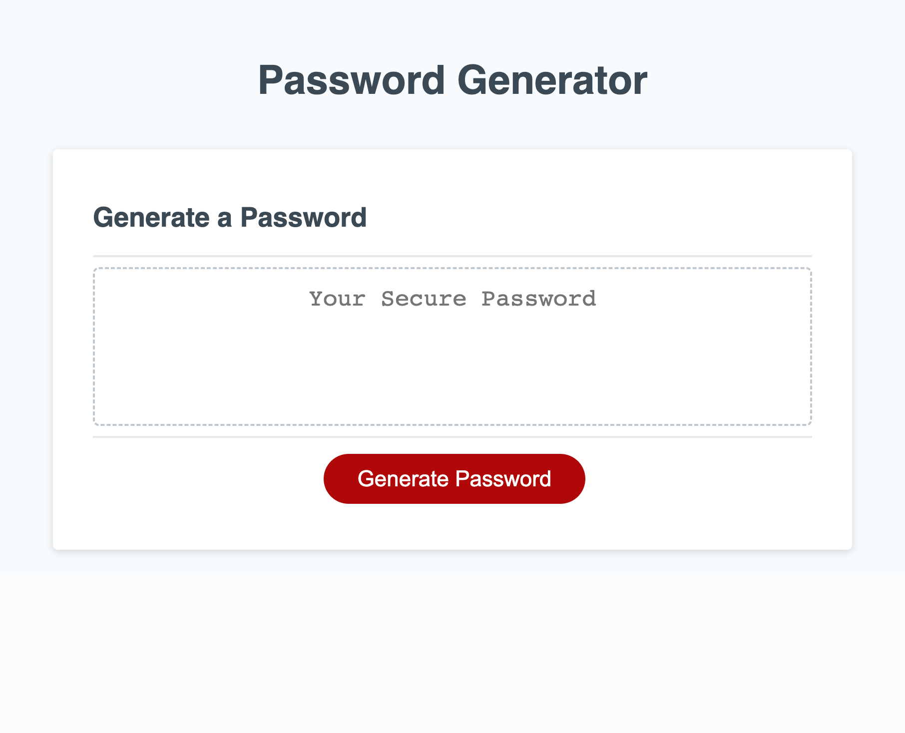

# UofT Bootcamp Module 1 Challenge

## Table of Contents

- [UofT Bootcamp Module 1 Challenge](#uoft-bootcamp-module-1-challenge)
  - [Table of Contents](#table-of-contents)
  - [Description](#description)
  - [GitHub Pages](#github-pages)
  - [GitHub Repository](#github-repository)
  - [Preview Screenshot](#preview-screenshot)
  - [Credits](#credits)
  - [License](#license)

## Description

A password generator that provides a password from 8-128 characters long. The user can select the password length and which types of characters to include.

## GitHub Pages

https://shaun-nelson.github.io/bootcamp-module-3-challenge/

## GitHub Repository

https://github.com/Shaun-Nelson/bootcamp-module-3-challenge

## Preview Screenshot

## Credits

https://owasp.org/www-community/password-special-characters

https://stackoverflow.com/questions/5767325/how-can-i-remove-a-specific-item-from-an-array-in-javascript

https://stackoverflow.com/questions/9425009/remove-multiple-elements-from-array-in-javascript-jquery

## License

MIT License

Copyright (c) 2023 Shaun-Nelson

Permission is hereby granted, free of charge, to any person obtaining a copy
of this software and associated documentation files (the "Software"), to deal
in the Software without restriction, including without limitation the rights
to use, copy, modify, merge, publish, distribute, sublicense, and/or sell
copies of the Software, and to permit persons to whom the Software is
furnished to do so, subject to the following conditions:

The above copyright notice and this permission notice shall be included in all
copies or substantial portions of the Software.

THE SOFTWARE IS PROVIDED "AS IS", WITHOUT WARRANTY OF ANY KIND, EXPRESS OR
IMPLIED, INCLUDING BUT NOT LIMITED TO THE WARRANTIES OF MERCHANTABILITY,
FITNESS FOR A PARTICULAR PURPOSE AND NONINFRINGEMENT. IN NO EVENT SHALL THE
AUTHORS OR COPYRIGHT HOLDERS BE LIABLE FOR ANY CLAIM, DAMAGES OR OTHER
LIABILITY, WHETHER IN AN ACTION OF CONTRACT, TORT OR OTHERWISE, ARISING FROM,
OUT OF OR IN CONNECTION WITH THE SOFTWARE OR THE USE OR OTHER DEALINGS IN THE
SOFTWARE.
